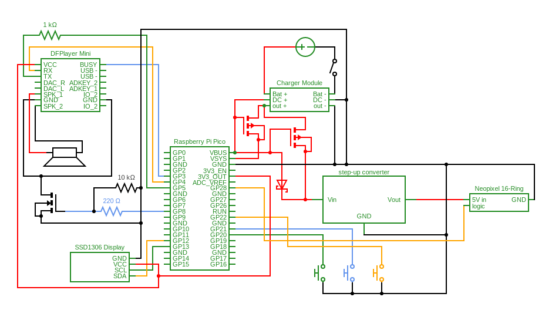

# pi-pico-alarmclock

Building a working alarmclock based on a Raspberry Pi Pico W

The general idea is to build a device that can reliably wake up my kids who are in an age range, where this is a challenge. So it should sport these features:

+ be somewhat Star wars - themed (not my idea)
+ have a display that shows the time and some other information
+ have a speaker that can play music or sounds, and loudly so
  + have a way to hold music/sound files for that purpose
+ have a thingy that can turn on a bright light, ideally an array of RGB LEDs or some such. Because "when my room is still dark, I cannot properly wake up"
+ have some buttons to set the alarm time and to toggle the alarm
  + without making it too easy to silence the actual alarm when it is going off
+ have the ability to both run on battery power or be powered by a USB charger
+ be built into some enclosure that looks nice, is easy enough to print and assemble and can somehow house the components in a sensible way
+ be fun for daddy to build and program

State of affairs: Wiring and coding is done. There is one issue left to fix (Sound is unreliable, will not turn on as expected 50% of the time).
So this is next: Figure out this bug and then off to designing&printing a case.

## Disclaimer

This project is one of my first projects using MicroPython and electronics. I have some background in software development with niche/proprietary languages and no background at all in electronics and Python. So most of this I figured out as I went.
That being said: This is going to be full of imperfections. Use any of this at Your own risk and in case You spot my mistakes, I am glad to hear of them! Besides that I am happy if this is useful or fun for somebody.

## Description

+ The display shows the current time. A lightsaber-symbol indicates, if the alarm is active or not. A battery indicator shows the battery charge or indicated the device is currently usb-powered.
+ To get the current time, on startup and every 6 hours subsequently the device will connect to Wifi, get the time from a timeserver and update the RTC with that.
+ Button-driven operations:
  + The green button will toggle the alarm active/inactive, when in normal operation mode
  + The yellow button will toggle system info being displayed or the normal time mode being displayed
  + The blue button will enter the mode for setting the alarm time. The current alarm time will be displayed (blinking) and the top area will display a symbol indicating that we are doing some sort of setup.
    + In this mode the green button will increase the hour digits and the yellow button will increase the minutes digits. Pressing blue again will save the new alarm time and resume normal operation.
+ Analog clock: The NeoPixel will show an approximation of an analog clock when in normal operation. The blue light indicates seconds, the green light indicates minutes and the red one indicates hours. When hands meet, their color is mixed. (I know... but I had way too much fun)
+ Alarm:
  + 5 Minutes before the alarm time the NeoPixel will turn off the analog clock and simulate a sunrise, going from few and red lights to more and warm-white lights.
  + At the same time in the indicator area of the display we will show a random color as text, using the button colors. Pressing the appropriate button will proceed to show the next color, until one has pressed all three buttons in the order the device wanted them. Completing the sequence will abort the alarm at any stage. The assumption is: If You are awake enough to have found and pressed the buttons in the random order that You were presented, You should be awake enough to get out of bed.
  + At the actual alarm time the sunrise will becompleted and the NeoPixel will display some fancy lighshow-things. At the same time the Music starts tom play, in my case here I chose the Imperial March, because that is what the kids love.


## Code

The code project is structured into these main parts: `main.py`, `classes`, and `drivers` as well as `settings` and `media`. 

|part|contents|
|:--|:--|
|main.py|Main script, doing very little besides instantiating.|
|drivers|Drivers and helpers for specific components. I have written none of these myself, each file has a comment saying where I found it.|
|classes|Classes for each logical component used in this project.|
|settings|A few `json` files to remember settings and magic strings.|

One file in settings is not checked into this repository for obvious reasons. Add one `wifi.json` to settings, structured like this:

```json
{
    "ssid": "YOUR SSID",
    "password": "YOUR PASSWORD"
}
```

### Testing and Tests

After a while this projects code got quite messy and I spent a fair amount of time restructuring it into classes with a small brother of dependency injection. This not only helped me to escape dependency hell but also allows for easy mocking and testing in isolation. I did write some tests here and there, typically where I ran into some problem that i was too lazy to iron out by manually testing the full application over and over again. None of this is perfect, but it sure was fun to do.

What I still sorely miss is a way to debug MicroPython Code. Writing anything remotely complex without is no fun.

### media

The folder contains images used for displaying things on the OLED display. The OLED driver provides only very limited support for text, there is no way i found to change font, font size and also (not an issue here) we cannot display all German letters. So if one wants some nicer numbers, some nice state indicators and the like one has to use images. I have used [GIMP](https://www.gimp.org/) to create these images. I have used the `Export as...` function to export them as 'pbm' files. They have to be converted to indexed color and when exporting to pbm they have to be exported as 'raw' format. The OLED driver can then read these files and display them on the screen.

A really good tutorial on how to create these images can be found [here](https://blog.martinfitzpatrick.com/displaying-images-oled-displays/). I would not have figured this out without.

## Components and Wiring

The central part of this project is the Raspberry Pi Pico W. I am sure everything could be done with a different microcontroller, as long as MicroPython is supported. I chose the Pico W because... I had one.

### Components

|Component|Description|
|---------|---------|
|Microcontroller|Raspberry Pi Pico W|
|OLED Display|SSD1306 compatible I²C OLED Display 128*64 pixels with two color yellow/blue. Input Voltage 3.3V - 5V, but must support 3.3V because that is what we are using. Single-color will work just as well, since the colors are actually fixed to sections of the display and cannot be coded.|
|battery|I use a 18650 Lithium-Polymer battery with 3350mAh. Anything else will work, als long as it fits with the charger module, battery holder and puts out no more than 5V, since You will be plugging it into Pi Pico and the step-up-converter.|
|battery holder|really anything will do, that can hold one Lithium-Polymer unit. Consider adding a switch between battery and charger or be as lazy as me and take out the battery whenever You want to truly power down.|
|charger module|I used a TC4056A module, capable of drawing power from Micro-USB or input pads and capable to charge/discharge the above battery safely.|
|NeoPixel ring|I used WS2812B with 16 RGB LED on it. If You want more LED make sure to check if You can power them safely. Each LED will draw ~60mA and that quickly exceeds either the 300mA the Pico can supply directly or what the step-up-converter attached to the USB or battery power supplies can deliver. In my case here the step-up-converter is rated for 1000mA and so this should be okay.|
|step-up converter|A step up capable to convert 2.5V - 5V to steady 5V. Required to power the NeoPixel-Ring. I have used HW-085. There are a ton of these things available everywhere, make sure it is DC-DC and can put out 1000mA for 5V and can convert to that from whatever You expect to come out of Your power supply.|
|speaker|I have used DFplayer Mini 3 Watt 8 Ohm speaker, 70*30*15mm. They can be found in some flavors from multiple vendors. Depending on the form factor You may need to adjust the case, but I guess that cannot be helped since there are so many different of these speakers around.|
|p-channel MOSFET|Two used to switch power modules. I have used IRF9540 which is overkill and and more efficient options exist. These things are rated for up to 100V and the switching voltage is uncomfortably close to USB typical ~5V. So, maybe they now have a higher voltage drop from source to drain, than I would like.|
|Schottky diode|One used to prevent power from flowing back into Pi Picos VBUS when powering from battery. Anything rated for up to 5V will do.|
|mp3 module|I have used DFR0299, which was easy to wire. It has a micro-sd card slot and an internal amplifier, greatly reducing overall complexity compared to other solutions I found. Also unfortunately my last struggle left... not yet reliable.|
|micro sd card|Really, anything You have lying around, formatted to FAT32.|
|push button|Three used. They usually come without caps and I chose caps in three different colors.|

### Wiring

Here is my best attempt at a wiring diagram. I have used [Circuit Diagram](https://www.circuit-diagram.org/) to create it.



### Power Consumption

My observed battery life is around 36 hours from fully charged to the charger module switching everything off. This does seem a bit quick for my gut feeling, so I wanted to get a better idea if I have made a mistake somewhere or if I could reasonably expect to be able to tweak that somehow.

These are the assumptions I made regarding power consumption. I did not measure any of these but researched online to arrive at some idea. In general my calculation based on these assumptions matches what I can observe. So for the time being, 36h is my battery life.

|Component|Current (mA)|Current (Ah)|
|:--|:--|:--|
|Pi Pico|40.00|0.04|
|OLED|11.00|0.011|
|NeoPixel|18.00|0.018|
|all Wires, Diodes, MOSFET|8.00|0.0080|
|Step-up-converter loss|4.30|0.0043|
|DRF0299|15.00|0.015|

The hardest part to put a number on is the Pi Pico itself. Online sources say that under full load it consumes a fraction under .1Ah but then I do not put it under very much load here. On the other hand we also never not use the Pico, there is at least one timer firing every 3.7s to drive the analog clock. I am also still unsure if the main loop iterating over `sleep`n and then `idle` is really the best way to keep the application alive, power-wise. Anyway, I guessed .04Ah for constantly doing stuff but not doing very heavy calculations.

For the OLED I found sources where people measured power consumption of similar devices and from one diagram I found I took the .011Ah. For the NeoPixel I found in the specs that one uses 60mA on full power. The analog clock running most of the time has three LEDs on at 10% brightness, so that should be .018Ah. For all the wires and MOSFET and the diode I basically asked ChatGPT for typical loss and got a fairly believable answer, broken down into a number of assumptions. Best I have, so that would be .0085Ah. The step-up converter actually has an efficiency in the specs and that could be used to calculate the power loss with some accuracy, but in my case here the step-up will either be used to convert from ~5V to 5 or if the battery is powering the battery will be at a voltage somewhere between 2.5V and 4V... so the conversion required will differ all the time. So I assume we will be on 3.5V input on average and to be safe I assume on average 90% efficiency and that ends us at .0043Ah.

The DRF0299 says ~15mA in the specs, so .015Ah in the calculation. Like with the NeoPixel, most of the time it does very little and I did not try and calculate what power consumption is like when playing music and driving the speaker, which must be a lot more.

Now... does that serve any purpose?

I observed roughly 36h of battery life. My LiPo rechargeable battery has 3350mA, so 3.35Ah. When dividing that by the sum of my consumers (.0918Ah) I arrive at 36.49237 hours of battery life that I would calculate. So I am, with a degree of uncertainty, sure I am understanding where power is consumed. The most volatile component seems to be the Pico itself.

So here is what I tried or planned to do in order to optimize power consumption:

+ **Pico**: The microcontroller is the most power-hungry component by a long shot. The only reason we need it doing things frequently is the seconds hand on the analog clock.
  + So I fiddled with `lightsleep()` to see if I could achieve the same functionality. This did not work for me. I may have gotten something wrong, but the way it looks the device does not wake up from timers and could wake up from interrupts, but even then not a rising or falling Pin, but a high or low pin. Beyond my expertise at this point to make use of, if there even is a way.
  + Underclocking the Pico is easy and will reduce power consumption. As we are not doing any heavy lifting in this project, we surely do not need the full clock speed. I found that mostly everything works even of half the frequency, even if feeling a little sluggish at startup and when using the buttons to set alarm time. Unfortunately the NeoPixel Ring stops working even when reducing the frequency moderately. It kind of still lights up and kind of inspired by what I coded... but sometimes it was an LED too much, too little, not the color I wanted, not the position I wanted. Very odd, but that for now is the end of reducing clock speed for me.
+ **OLED**: Is not needed at full brightness and should use less power when dimmed. Unfortunately no amount of tinkering with the driver got me a visible effect, so this is probably a dead end, too.
+ **system loss**: When finally taking things out of the breadboard and soldering I will make sure to make wires as short as they can reasonably be, solder the gate pins of both MOSFET together, maybe buy more appropriate MOSFET ... cut the legs of the diode to solder as close to the thing as possible. And generally see to good connections without solder wire blobs. Nothing I can do, now. Also nothing that I expect to change the overall result much.